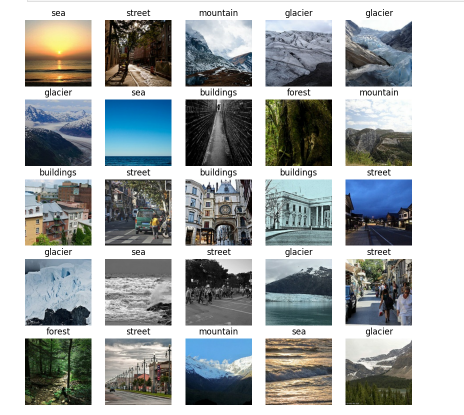

# Intel Image Classification Project

This project utilizes a pre-trained VGG19 model combined with a custom Sequential model to classify images from the Intel Image Classification dataset into six categories: `buildings`, `forest`, `glacier`, `mountain`, `sea`, and `street`.

## Project Overview
The primary goal of this project is to leverage transfer learning to achieve high accuracy on the Intel dataset. The VGG19 model is used as the feature extractor, and a custom dense network is added to perform classification. 

## Dataset
The dataset contains images categorized into six classes:
- **Buildings**
- **Forest**
- **Glacier**
- **Mountain**
- **Sea**
- **Street**

Below is a sample image from the dataset:



## Methods
1. **Pre-Trained Model**: VGG19 was employed as the feature extractor with `include_top=False`.
2. **Custom Network**: A custom dense network with the following layers:
   - GlobalAveragePooling2D
   - Dense layers (4096, 2048, and 1024 neurons) with ReLU activation
   - Dropout layer (rate = 0.5)
   - Output layer with 6 neurons and softmax activation
3. **Compilation and Optimization**:
   - Loss: `categorical_crossentropy`
   - Optimizer: Adam with a learning rate of 0.0001
   - Metric: Accuracy

## Results
- The model achieved a classification accuracy of approximately **90%** on the validation dataset.
- The transfer learning approach significantly enhanced performance compared to training from scratch.

## How to Run
1. Install the required Python packages:
   ```bash
   pip install tensorflow numpy matplotlib
   ```
2. Load the dataset and preprocess it.
3. Train the model using the provided `fit()` function with the dataset.
4. Evaluate the performance on the test data.

## Conclusion
The VGG19-based model successfully classifies the images with high accuracy, demonstrating the power of transfer learning in image classification tasks.


